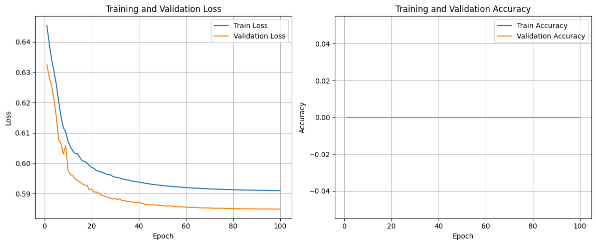
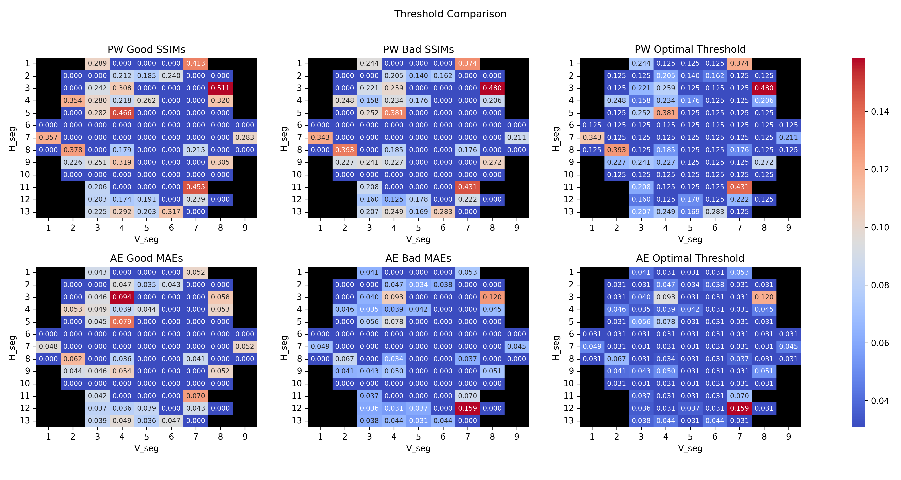
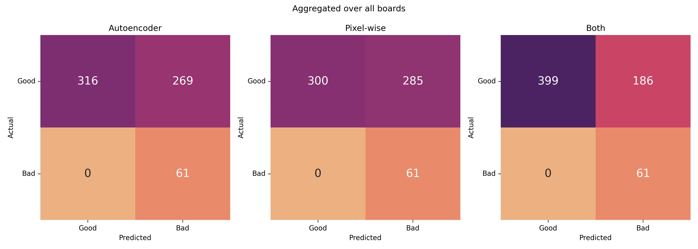

# UA CMS: Hexaboard Visual Inspection

A deep learning-based visual inspection system for detecting defects in hexaboard segments from the High Granularity Calorimeter (HGCAL) detector of the CMS experiment at CERN.

## Description

The High Granularity Calorimeter (HGCAL) is a key component of the CMS detector upgrade for the High Luminosity Large Hadron Collider (HL-LHC). HGCAL consists of silicon sensors arranged in hexagonal modules called hexaboards, which provide unprecedented spatial resolution for particle detection in the forward region of the CMS detector.


*Cutaway diagram of CMS detector (retrieved from https://cds.cern.ch/record/2665537/files/)*

Hexaboards are critical silicon sensor modules that form the active detection layers of the HGCAL endcap calorimeter. These hexagonal-shaped boards contain arrays of silicon pad sensors that measure the energy deposits from electromagnetic and hadronic showers. Each hexaboard must meet strict quality standards, as defects can significantly impact the detector's performance in measuring particle energies and positions with high precision.

This project implements an automated visual inspection system that combines:
- **Autoencoder-based anomaly detection**: A convolutional autoencoder trained on reference images to detect reconstruction anomalies
- **Pixel-wise comparison**: Traditional image comparison using Structural Similarity Index Measure (SSIM) between baseline and test images
- **Dual flagging system**: Segments are classified as defective if flagged by either or both methods, providing comprehensive defect detection

## Get Started

### Prerequisites

- Python 3.13 or higher
- Git

### Installation

1. **Clone the repository:**
    ```bash
    git clone <repository-url>
    cd visual-inspection
    ```

2. **Create and activate a virtual environment:**
    ```bash
    python -m venv venv

    # On Windows
    venv\Scripts\activate

    # On macOS/Linux
    source venv/bin/activate
    ```

3. **Install dependencies:**
    ```bash
    pip install -r requirements.txt
    ```

4. **Install PyTorch (GPU or CPU):**

    See: https://pytorch.org/get-started/locally/

## Train/Evaluate the Autoencoder

### Model Architecture

The system uses a compact convolutional autoencoder (`CNNAutoencoder`) with the following key features:

- **Encoder**: Stacked convolutional stages that progressively reduce spatial resolution to a compact bottleneck
- **Bottleneck**: Compressed latent representation
- **Decoder**: Symmetric upsampling path using `ConvTranspose2d` layers to reconstruct the original image
- **Loss Function**: `BCEWithLogitsLoss` for pixel-wise reconstruction

The model is trained to reproduce normal hexaboard segments; during inference, segments with poor reconstruction quality (low SSIM) are flagged as potential defects.

### Train the Model

Training is driven by a YAML configuration file that defines the model architecture and training hyperparameters.

To train the CNN autoencoder with a config file:

```bash
python -m scripts.train \
    --config-path ./configs/train_CNNAutoencoder.yaml \
    --checkpoint-path ./logs/CNNAutoencoder/checkpoint.pt \
    --train-data-dir ./data/train \
    --val-data-dir ./data/val
```

**Key training arguments:**
- `--config-path`: Path to the YAML training config (default: `./configs/train_CNNAutoencoder.yaml`)
- `--checkpoint-path`: Optional checkpoint to resume training from (default: `None`)
- `--train-data-dir`: Folder containing training hexaboard `.npy` files (default: `./data/train`)
- `--val-data-dir`: Folder containing validation hexaboard `.npy` files (default: `./data/val`)

Model and optimization specifics (batch size, optimizer, scheduler, loss, number of epochs, early stopping, etc.) are controlled by the YAML file referenced by `--config-path`.


*Model training and validation loss*

### Evaluate the Model

To evaluate the trained model and visualize reconstructions (uses a YAML config to reconstruct the model architecture):

```bash
python -m scripts.evaluate \
    --config-path ./configs/train_CNNAutoencoder.yaml \
    --best-model-path ./logs/CNNAutoencoder/best/run_01.pt \
    --good-hexaboard-dir ./data/test \
    --bad-hexaboard-dir ./data/bad_example \
    --display-segment-idx 83
```

**Key evaluation arguments:**
- `--config-path`: Path to the YAML config used to build the model (default: `./configs/train_CNNAutoencoder.yaml`)
- `--best-model-path`: Path to the trained model weights (default: `./logs/CNNAutoencoder/best/run_01.pt`)
- `--good-hexaboard-dir`: Folder containing a good hexaboard (default: `./data/test`)
- `--bad-hexaboard-dir`: Folder containing a bad hexaboard (default: `./data/bad_example`)
- `--display-segment-idx`: Segment index to display in the reconstruction plot (default: `83`)


*The model reconstructed poorly on bad segments, so SSIM is lower.*

## Calibrate the Thresholds

Use `scripts.calibrate` to compute per-segment SSIM thresholds for pixel-wise and autoencoder methods.

```bash
python -m scripts.calibrate \
    -b ./data/train/aligned_images1.npy \
    -g ./data/train/aligned_images2.npy \
    -j ./calibrations/damaged_segments.json \
    -s ./calibrations/skipped_segments.json \
    --latent-dim 32 \
    --init-filters 128 \
    --layers 2 2 2 \
    -w ./logs/CNNAutoencoder/best/run_01.pt \
    --device cuda
```

**Key Calibration Arguments:**
- `-b`: Baseline hexaboard `.npy` (default: `./data/train/aligned_images1.npy`)
- `-g`: Good hexaboard `.npy` (default: `./data/train/aligned_images2.npy`)
- `-j`: JSON map of damaged segments (default: `./calibrations/damaged_segments.json`)
- `-s`: JSON file listing segments to skip (default: `./calibrations/skipped_segments.json`)
- `--latent-dim`, `--init-filters`, `--layers`, `-w`, `--device`: Model arguments


*Threshold comparison across segments (black cells are skipped segments)*

## Inference Analysis

Run `scripts.analyze` to compute aggregated predictions on the full good and bad datasets and produce confusion matrices.

```bash
python -m scripts.analyze \
    --train-data-dir ./data/train \
    --val-data-dir ./data/val \
    --test-data-dir ./data/test \
    --bad-data-dir ./data/bad \
    -j ./calibrations/damaged_segments.json \
    -s ./calibrations/skipped_segments.json \
    --ae-threshold-path ./calibrations/ae_threshold.npy \
    --pw-threshold-path ./calibrations/pw_threshold.npy \
    --latent-dim 32 \
    --init-filters 128 \
    --layers 2 2 2 \
    -w ./logs/CNNAutoencoder/best/run_01.pt \
    --device cuda
```

**Key Analysis Arguments:**
- `--train-data-dir`, `--val-data-dir`, `--test-data-dir`: Folders with good hexaboards
- `--bad-data-dir`: Folder with bad hexaboards
- `-j`: JSON map of damaged segments (default: `./calibrations/damaged_segments.json`)
- `-s`: JSON file listing segments to skip (default: `./calibrations/skipped_segments.json`)
- `--ae-threshold-path`: Path to autoencoder per-segment threshold `.npy` (default: `./calibrations/ae_threshold.npy`)
- `--pw-threshold-path`: Path to pixel-wise per-segment threshold `.npy` (default: `./calibrations/pw_threshold.npy`)
- `--latent-dim`, `--init-filters`, `--layers`, `-w`, `--device`: Model arguments


*Aggregated confusion matrices over all analyzed boards (Good vs Bad classification per segment)*

## Run the Inspection

### Basic usage

To run the inspection pipeline (pixel-wise + autoencoder) on a new hexaboard:

```bash
python -m scripts.inspect \
    -b ./data/baseline_hexaboard.npy \
    -n ./data/test_hexaboard.npy \
    -s ./calibrations/skipped_segments.json \
    --ae-threshold-path ./calibrations/ae_threshold.npy \
    --pw-threshold-path ./calibrations/pw_threshold.npy \
    --latent-dim 32 \
    --init-filters 128 \
    --layers 2 2 2 \
    -w ./logs/CNNAutoencoder/best/run_01.pt \
    --device cuda
```

### Command-line Arguments

**Required Arguments:**
- `-b, --baseline-hexaboard-path`: Path to baseline hexaboard images (.npy file)
- `-n, --new-hexaboard-path`: Path to new hexaboard images to inspect (.npy file)

**Optional Arguments:**
- `-s`: JSON file listing segments to skip (default: `./calibrations/skipped_segments.json`)
- `--ae-threshold-path`: Path to autoencoder per-segment threshold `.npy` (default: `./calibrations/ae_threshold.npy`)
- `--pw-threshold-path`: Path to pixel-wise per-segment threshold `.npy` (default: `./calibrations/pw_threshold.npy`)
- `--latent-dim`: Autoencoder latent dimension (default: `32`)
- `--init-filters`: Initial filter count (default: `128`)
- `--layers`: CNN layer configuration (default: `[2, 2, 2]`)
- `-w`: Path to trained model weights (default: `./logs/CNNAutoencoder/best/run_01.pt`)
- `--device`: Computation device (default: auto-detect CUDA/CPU)

### Expected Input Format

The input `.npy` files should contain hexaboard image arrays with shape:
```
(H_seg, V_seg, height, width, num_channels)
```

Where:
- `H_seg`: Number of horizontal segments (`13`)
- `V_seg`: Number of vertical segments (`9`)
- `height, width`: Pixel dimensions of each segment `(1016, 1640)`
- `num_channels`: Color channels (`3`)

### Output

The inspection system outputs four categories of flagged segments:

1. **Double flagged**: Segments flagged by both autoencoder and pixel-wise methods
2. **Autoencoder flagged**: Segments flagged only by the ML model
3. **Pixel-wise flagged**: Segments flagged only by traditional comparison
4. **All flagged**: Union of all flagged segments

Each flagged segment is identified by its `(board_index, h_segment, v_segment)` coordinates.

### Example Output

```
Double flagged segments: [(0, 3, 2), (0, 7, 5)]
Autoencoder flagged segments: [(0, 1, 8), (0, 9, 3)]
Pixel-wise flagged segments: [(0, 5, 1)]
All flagged segments: [(0, 1, 8), (0, 3, 2), (0, 5, 1), (0, 7, 5), (0, 9, 3)]
```

## Testing

Run the test suite to verify the installation:

```bash
python -m pytest tests/ -v
```

## Project Structure

```
visual-inspection/
├── src/
│   ├── configs/           # Configuration modules
│   ├── engine/            # Training engine
│   ├── inferences/        # Inference implementations
│   ├── models/            # Neural network models
│   └── utils/             # Utility functions and datasets
├── scripts/               # Training, calibration, and inference
├── tests/                 # Unit tests
├── logs/                  # Model checkpoints and logs
├── data/                  # Data directory (add your .npy files here)
├── notebooks/             # Jupyter notebooks for analysis
└── calibrations/          # JSON and .npy files for thresholds calibration
```